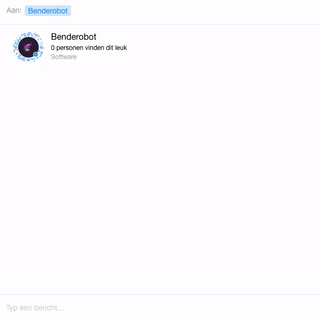
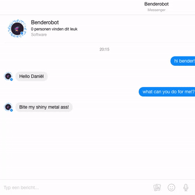
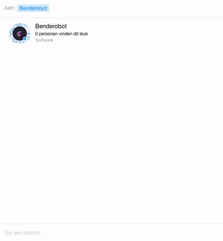

# Benderobot
Bender the facebook messenger bot.

**Proof of Concept** and a **work in progress**.

Retro Bender image  [attribution](https://dribbble.com/shots/2686048-I-Am-Retro-Bender).

## What can Bender do?
Bender can say hello:

Bender can fetch todays most popular posts from [Product Hunt](https://www.producthunt.com/):

Bender can fetch the "algo" feed from [devRant](https://www.devrant.io/):

_Note that you can't find Benderobot on facebook (yet), so
if you want to try it out, you need to run the API yourself
by following the instructions. This also means you have to
create your own facebook app and page._

## Facebook quick start
The API is being built following the [quick start quide](https://developers.facebook.com/docs/messenger-platform/quickstart).

## Running the API
The API will run on port `8888` by default and can be run with
`npm run dev` (will restart the API on any change in the source code) or `npm start`.

## Environment variables
| Variable | Description | Required |
| --- | --- | --- |
| PORT  | Port the web server will be running on  | No |
| *VERIFY_TOKEN | Facebook webhook verification token used to ping the configured URL | Yes |
| *PAGE_ACCESS_TOKEN | Facebook page access token used to make authenticated requests using the [Send API](https://developers.facebook.com/docs/messenger-platform/send-api-reference) | Yes |

_* See the [facebook quick start quide](https://developers.facebook.com/docs/messenger-platform/quickstart) on how to obtain this token._

## Deployment
Recommend way to deploy is using heroku, following the [get started guide](https://devcenter.heroku.com/articles/getting-started-with-nodejs#introduction).

## Documentation
TODO
